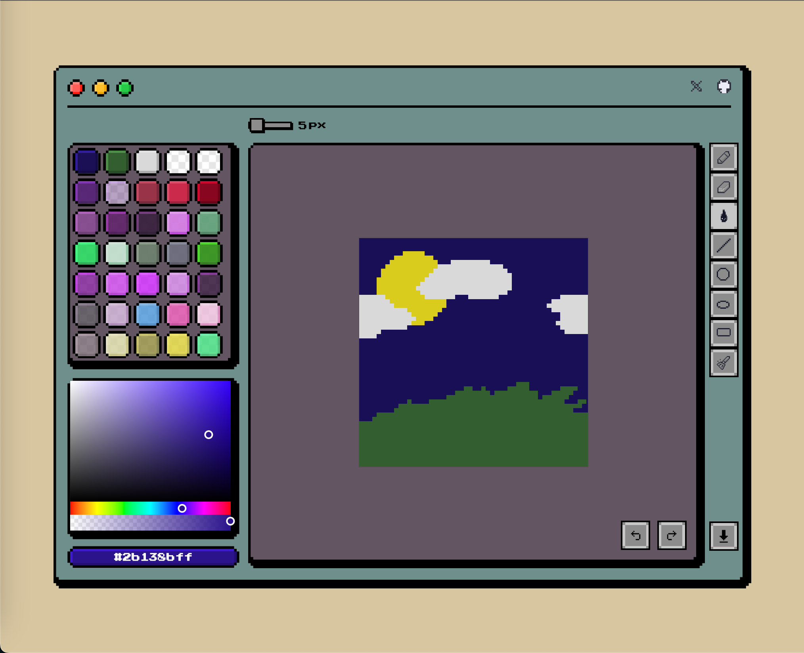

# About this project
It's a free online pixel art drawing tool.

## Why I made it?
I bought [Octopath Traveler II](https://en.wikipedia.org/wiki/Octopath_Traveler_II) in 2024. The game’s scenery captivated me, and at that moment, a thought came to mind: maybe I could make a pixel art tool by myself one day.

After the idea took root, I started looking for pixel art editors in the community and eventually discovered [Aseprite](https://www.aseprite.org/).
I was inspired by its color design and began developing my own pixel art editor.
It’s not perfect yet, but I’ll keep improving it—step by step—until it becomes what I envisioned.

Lately, I’ve also been playing [Stardew Valley](https://en.wikipedia.org/wiki/Stardew_Valley) in my free time.

## 🙏 Special Thanks
Huge thanks to [Luke Morrigan](https://github.com/CodeFoodPixels) for [Pixel-Corners](https://github.com/CodeFoodPixels/pixel-corners), which helped me implement beautiful pixel-style UI components.

## 🎉 Version 0.1.0
|      | Tool Description              |   Shortcut |
|------|-------------------------------| ------------|
| ✏️    | Pencil tool                   | P          |
| 🧽    | Eraser tool                   | E          |
| 💧    | Bucket tool                  |  B          |
| 📏    | Line tool                     | L          |
| ⚪    | Circle tool                   | C/Shift + C |
| 🟥    | Square tool                   | S          |
| 🔁    | Undo & Redo                  | ⌘/Ctrl + Z|
| 🧹    | Broom                        | |
| 📤    | Download and save as PNG     |             |
| 🌈    | Color picker                 |             |

## 🚧 Version 0.2.0
- [ ] Supports for persistent storage with [IndexedDB](https://developer.mozilla.org/en-US/docs/Web/API/IndexedDB_API)
- [ ] Supports multiple frames for animation
- [ ] Supports canvas zooming
- [ ] Supports canvas preview
- [ ] Supports different canvas sizes
- [ ] Download and save as GIF
- [ ] Select tool
- [ ] Gradient tool

## Tech stack
- [Vue 3](https://vuejs.org/guide/introduction.html)
- [Pinia](https://pinia.vuejs.org/introduction.html)
- [TypeScript](https://www.typescriptlang.org/)
- [tailwindcss](https://tailwindcss.com/)
- [Web Worker](https://developer.mozilla.org/en-US/docs/Web/API/Web_Workers_API/Using_web_workers)
- [OffscreenCanvas](https://developer.mozilla.org/en-US/docs/Web/API/OffscreenCanvas)
- [Vite](https://vite.dev/guide/)

## License
Licensed under the MIT License.
